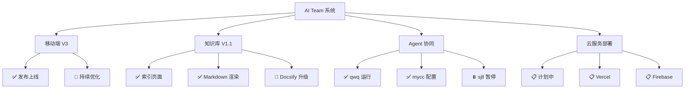
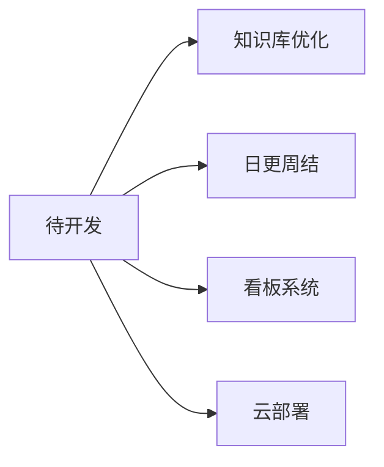
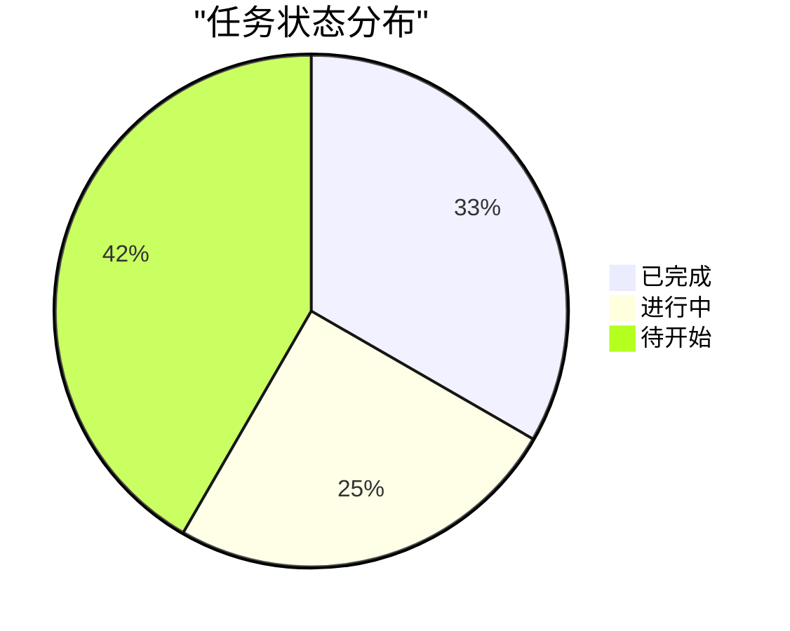
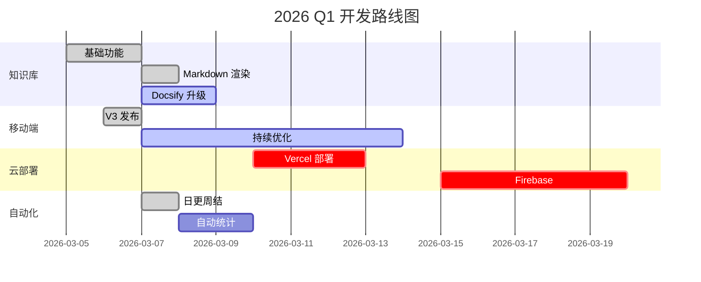

# 项目看板

**更新日期**: 2026-03-07  
**状态**: 🟢 进行中

---

## 📊 项目总览



---

## 🎯 当前迭代 (Sprint 1)

**周期**: 2026-03-07 ~ 2026-03-14

### 待办 (Backlog)



### 进行中 (In Progress)

| 任务 | 负责人 | 进度 | 预计完成 |
|------|--------|------|----------|
| Docsify 升级 | AI Team | 80% | 2026-03-07 |
| 日更周结模板 | AI Team | 100% | 2026-03-07 |
| 看板支持 | AI Team | 50% | 2026-03-08 |

### 已完成 (Done)

- ✅ 知识库网页版上线
- ✅ Markdown 渲染支持
- ✅ 日更周结模板创建
- ✅ 系统全局检查完成

---

## 📈 进度追踪

### 燃尽图

```mermaid
xychart-beta
    title "Sprint 1 燃尽图"
    x-axis [D1, D2, D3, D4, D5, D6, D7]
    y-axis "剩余任务" 0 --> 10
    line [10, 8, 6, 4, 2, 1, 0]
```

### 任务分布



---

## 🚀 路线图

### 2026 Q1



---

## 📋 任务详情

### 知识库优化

| 子任务 | 状态 | 优先级 |
|--------|------|--------|
| Docsify 集成 | 🔄 进行中 | P0 |
| 侧边栏优化 | 🔄 进行中 | P0 |
| 全文搜索 | ⏳ 待开始 | P1 |
| 夜间模式 | ⏳ 待开始 | P2 |

### 日更周结

| 子任务 | 状态 | 优先级 |
|--------|------|--------|
| 模板创建 | ✅ 完成 | P0 |
| 自动生成 | ✅ 完成 | P0 |
| 定时提醒 | ⏳ 待开始 | P1 |
| 数据统计 | ⏳ 待开始 | P1 |

---

## 🔗 快速链接

- [今日日志](6-Diaries/2026-03/2026-03-07.md)
- [本周总结](6-Diaries/weekly/2026/2026-W10.md)
- [系统状态](0-System/system-health-report.md)
- [修复记录](scripts/FIXES-SUMMARY.md)

---

*最后更新：2026-03-07 10:00*
