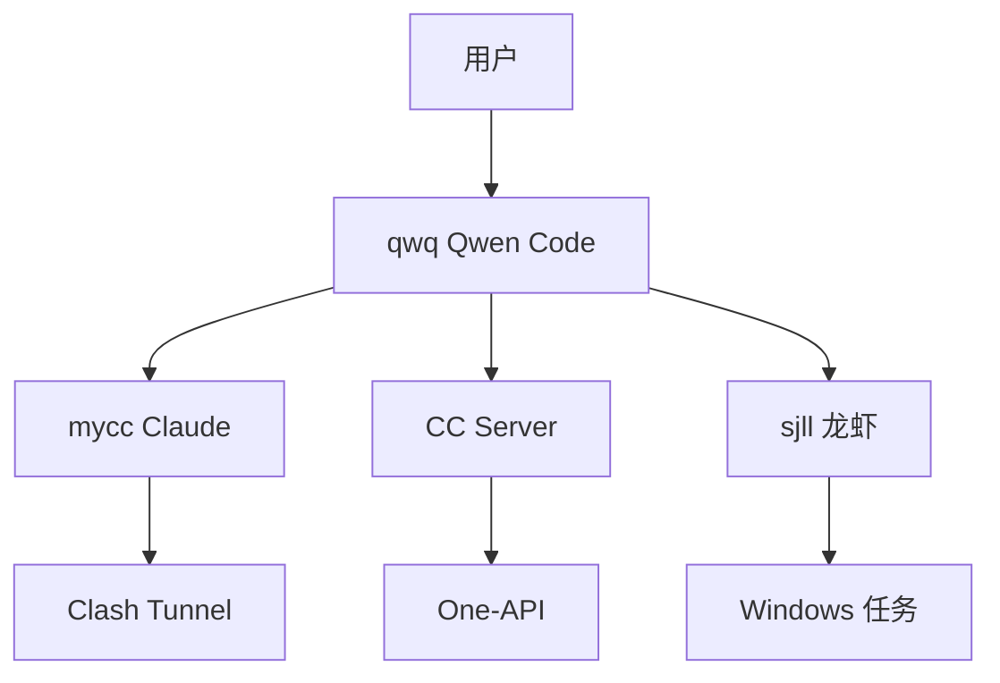

# AIHub 知识库 → Obsidian 知识图谱集成评估报告

**日期**: 2026-03-13  
**评估对象**: `/root/air/aihub/knowledge`  
**目标**: 迁移至 Obsidian 并建立知识图谱

---

## 📊 当前知识库状态

### 文件统计

| 目录 | Markdown 文件数 | 说明 |
|------|----------------|------|
| `0-System/` | 32 | 系统架构、配置、Agent 文档 |
| `2-Projects/` | 4 | 项目文件 |
| `4-Assets/` | 7 | 资产资源 |
| `6-Diaries/` | 5 | 日记日志 |
| 其他目录 | ~156 | 移动端、脚本、任务等 |
| **总计** | **204** | 完整知识库 |

### 当前结构 (PARA 组织法)

```
knowledge/
├── 0-System/           # 核心系统文档
│   ├── ARCHITECTURE.md
│   ├── context.md
│   ├── status.md
│   ├── about-me/
│   │   ├── profile.md
│   │   └── sjll-lobster.md
│   └── agents/
│       └── mycc/
├── 2-Projects/         # 项目
├── 4-Assets/           # 资源资产
├── 6-Diaries/          # 日记
├── mobile-web/         # 移动端代码/文档
├── scripts/            # 脚本工具
└── shared-tasks/       # 任务协同
```

---

## ✅ 迁移至 Obsidian 的可行性

### 优势

| 项目 | 评估 | 说明 |
|------|------|------|
| **Markdown 格式** | ✅ 完全兼容 | 所有文件均为 `.md` 格式 |
| **目录结构** | ✅ 清晰 | PARA 组织法，符合知识管理最佳实践 |
| **内部链接** | ⚠️ 需检查 | Docsify 链接需转换为 Obsidian 格式 |
| **标签系统** | ⚠️ 待建立 | 当前无统一标签规范 |
| **双向链接** | ⚠️ 待建立 | 可逐步添加 `[[链接]]` |

### 挑战

1. **Docsify 特定语法** - 部分 Markdown 包含 Docsify 插件语法
2. **相对路径** - 需调整为 Obsidian 兼容格式
3. **知识图谱** - 需建立双向链接网络

---

## 🗺️ Obsidian 知识图谱设计方案

### 推荐 Vault 结构

```
AIHub Vault/
├── 📁 0-Inbox/              # 临时收集（新增）
├── 📁 10-System/            # 系统核心（原 0-System）
│   ├── 📄 Home.md          # 知识库首页（MOC）
│   ├── 📄 Architecture.md  # 架构总览
│   ├── 📄 Context.md       # 上下文
│   ├── 📄 Status.md        # 当前状态
│   ├── 📁 Agents/          # Agent 文档
│   │   ├── qwq.md
│   │   ├── mycc.md
│   │   └── sjll.md
│   ├── 📁 Config/          # 配置文档
│   │   ├── SSH.md
│   │   ├── Clash.md
│   │   └── OneAPI.md
│   └── 📁 Guides/          # 使用指南
│       ├── QuickStart.md
│       └── Troubleshooting.md
├── 📁 20-Projects/          # 项目（原 2-Projects）
│   ├── 📄 Project-Index.md # 项目索引（MOC）
│   ├── 📁 Mobile-Web/
│   └── 📁 AI-Agent/
├── 📁 30-Diaries/           # 日记（原 6-Diaries）
│   ├── 📄 Daily-Template.md
│   ├── 📄 Weekly-Template.md
│   └── 📁 2026/
│       └── 2026-03.md
├── 📁 40-Assets/            # 资源（原 4-Assets）
│   ├── 📁 Code-Snippets/
│   ├── 📁 API-Reference/
│   └── 📁 Templates/
├── 📁 50-Archive/           # 归档（原 5-Archive）
└── 📁 99-Attachments/       # 附件（Obsidian 自动）
```

### 核心 MOC (Map of Content)

#### 1. System Home (`0-System/Home.md`)

```markdown
# AI Team System Hub

## 🎯 快速入口
- [[Architecture]] - 系统架构
- [[Status]] - 当前状态
- [[QuickStart]] - 快速开始

## 🤖 Agent 团队
- [[qwq]] - Qwen Code（协调器）
- [[mycc]] - Claude Code（本地协同）
- [[sjll]] - 龙虾（Windows 任务）

## 📊 核心概念
- [[Clash Tunnel]] - 代理隧道
- [[One-API]] - 模型网关
- [[Task Router]] - 任务路由

## 📈 相关索引
- [[Project-Index]] - 项目总览
- [[Daily-Index]] - 日记索引
```

#### 2. Architecture Map (`0-System/Architecture.md`)



---

## 🔗 双向链接策略

### 链接类型

| 类型 | 语法 | 用途 |
|------|------|------|
| **内部链接** | `[[文档名]]` | 核心双向链接 |
| **嵌入链接** | `![[文档名]]` | 嵌入内容块 |
| **块引用** | `[[文档名#^block-id]]` | 引用特定段落 |
| **标签** | `#标签名` | 分类标记 |

### 推荐标签体系

```
#system        - 系统核心
#agent         - AI 助理
#config        - 配置文档
#guide         - 使用指南
#troubleshoot  - 故障排查
#project       - 项目
#diary         - 日记
#template      - 模板
#archive       - 归档
```

---

## 📦 迁移步骤

### 阶段 1: 准备 (1 天)

```bash
# 1. 创建 Obsidian Vault
mkdir -p ~/Obsidian/AIHub

# 2. 复制知识库
cp -r /root/air/aihub/knowledge/* ~/Obsidian/AIHub/

# 3. 安装 Obsidian 插件
# - Dataview
# - Templater
# - QuickAdd
# - Excalidraw
# - Obsidian Git
```

### 阶段 2: 结构调整 (1 天)

```bash
# 重命名目录以匹配 Obsidian 习惯
mv 0-System 10-System
mv 2-Projects 20-Projects
mv 6-Diaries 30-Diaries
mv 4-Assets 40-Assets
```

### 阶段 3: 链接修复 (2-3 天)

- 使用脚本批量转换 Docsify 链接
- 添加双向链接 `[[ ]]`
- 建立 MOC 索引

### 阶段 4: 知识图谱 (持续)

- 使用 Obsidian Graph View
- 添加 Dataview 查询
- 建立自动化工作流

---

## 🛠️ 自动化脚本

### 链接转换脚本

```python
#!/usr/bin/env python3
"""
转换 Docsify 链接为 Obsidian 格式
"""
import re
import os

def convert_docsify_to_obsidian(content):
    # [文本](路径.md) → [[路径\|文本]]
    content = re.sub(
        r'\[([^\]]+)\]\(([^)]+\.md)\)',
        lambda m: f"[[{m.group(2).replace('.md', '')}|{m.group(1)}]]",
        content
    )
    return content
```

### Dataview 查询示例

```dataview
TABLE file.mtime as "最后修改", file.tags as "标签"
FROM "10-System"
WHERE contains(file.tags, "#agent")
SORT file.mtime DESC
```

---

## 📊 知识图谱可视化预期

### Graph View 配置

```json
{
  "collapse-factor": 2,
  "depth": 3,
  "link-length": 20,
  "node-size": 5,
  "show-tags": true,
  "show-attachments": false
}
```

### 预期节点关系

```
                    ┌─────────────┐
                    │  Home.md    │
                    └──────┬──────┘
                           │
         ┌─────────────────┼─────────────────┐
         │                 │                 │
    ┌────▼────┐      ┌────▼────┐      ┌────▼────┐
    │Architecture│    │ Agents  │      │Projects │
    └────┬────┘      └────┬────┘      └────┬────┘
         │                 │                 │
    ┌────▼────┐      ┌────▼────┐      ┌────▼────┐
    │ Clashes │      │ qwq     │      │Mobile   │
    │ OneAPI  │      │ mycc    │      │Web      │
    │ SSH     │      │ sjll    │      │         │
    └─────────┘      └─────────┘      └─────────┘
```

---

## ⚠️ 注意事项

### 需要手动处理

1. **代码块语法高亮** - 部分可能需要调整
2. **Mermaid 图表** - Obsidian 原生支持，但语法可能有差异
3. **自定义 CSS** - Docsify 主题需重新设计
4. **搜索功能** - Obsidian 搜索与 Docsify 不同

### 建议保留 Docsify

- 作为**对外发布**的静态网站
- Obsidian 作为**内部编辑**和知识管理
- 两者通过 Git 同步

---

## 📋 推荐 Obsidian 插件

| 插件 | 用途 | 优先级 |
|------|------|--------|
| **Dataview** | 数据库查询 | ⭐⭐⭐ |
| **Templater** | 模板引擎 | ⭐⭐⭐ |
| **QuickAdd** | 快速添加 | ⭐⭐ |
| **Obsidian Git** | 版本控制 | ⭐⭐⭐ |
| **Excalidraw** | 绘图 | ⭐⭐ |
| **Calendar** | 日记导航 | ⭐⭐ |
| **Tag Wrangler** | 标签管理 | ⭐⭐ |
| **Outliner** | 大纲编辑 | ⭐ |

---

## 🎯 实施建议

### 立即执行 (P0)

1. ✅ 创建 Obsidian Vault
2. ✅ 复制现有知识库
3. ✅ 安装核心插件

### 本周完成 (P1)

1. 调整目录结构
2. 创建 MOC 索引
3. 建立标签体系

### 本月完成 (P2)

1. 添加双向链接
2. 配置 Dataview 查询
3. 建立自动化工作流

---

## 📈 预期收益

| 方面 | 当前 (Docsify) | 迁移后 (Obsidian) |
|------|---------------|------------------|
| **编辑体验** | ⭐⭐ | ⭐⭐⭐⭐⭐ |
| **知识关联** | ⭐⭐ | ⭐⭐⭐⭐⭐ |
| **搜索效率** | ⭐⭐⭐ | ⭐⭐⭐⭐⭐ |
| **可视化** | ⭐⭐⭐ | ⭐⭐⭐⭐ |
| **发布能力** | ⭐⭐⭐⭐⭐ | ⭐⭐ |
| **版本控制** | ⭐⭐⭐⭐ | ⭐⭐⭐⭐⭐ |

---

## ✅ 结论

**推荐迁移至 Obsidian**，理由：

1. **204 个 Markdown 文件** - 完全兼容，迁移成本低
2. **PARA 结构清晰** - 符合知识管理最佳实践
3. **双向链接** - 大幅提升知识关联效率
4. **Graph View** - 直观展示知识结构
5. **插件生态** - 丰富的自动化能力

**建议采用双轨制**：
- **Obsidian**: 内部编辑、知识管理
- **Docsify**: 对外发布、Web 访问

---

*评估完成时间：2026-03-13*  
*下一步：执行阶段 1 迁移准备*
